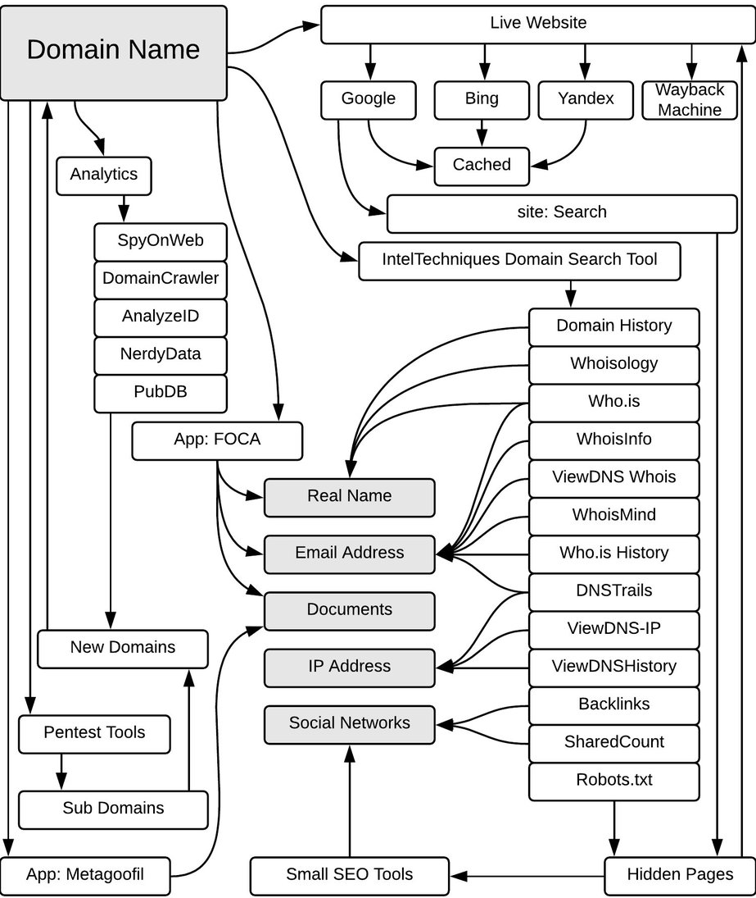

https://lost-minds.netlify.app/ (Prototype)

https://app.diagrams.net/

# Lost-Minds
Terrorists often create accounts on various social media platforms for spreading propaganda and hate material. In doing so, they usually use the same phone number or email address. Build a solution that can list out all accounts across various social media platforms which have been created using the specified phone number or email address.

The primary objective of this problem statement is to identify all social media accounts across various platforms which have been created using the specified phone number or email address.

· There are different types of social media platforms aimed at different types of users seeking different types of content. Some platforms are more popular in a particular country than others. Some appeal more to a certain age group. Some are for sharing videos, while some focus on pictures.

· Collectively, these social media platforms have a captive user base of billions of users in India and around the world.

· Terrorists widely use social media for radicalization, recruitment, spreading propaganda and seeking funding for their cause.

· In order to maximise their reach, especially for activities like spreading propaganda and hate material, and recruitment, terrorists often create accounts on multiple social media platforms.

· Most social media platforms require a valid phone number or an email to be entered at the time of registration, and typically, terrorists use the same set of details across multiple platforms.

· Build a solution that can list out all accounts across various social media platforms which have been created using the specified phone number or email address.

· Use of external third-party services is not recommended.

· Participants are expected to obtain suitable data required to work on this problem statement on their own.

